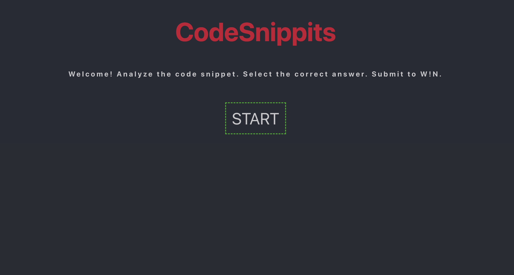
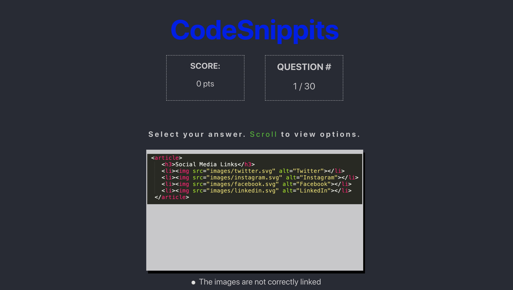
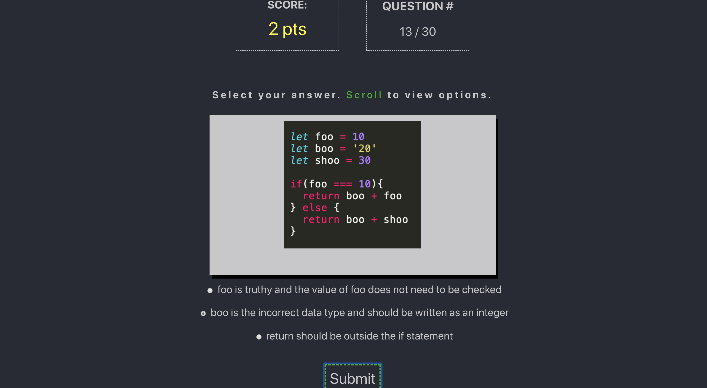
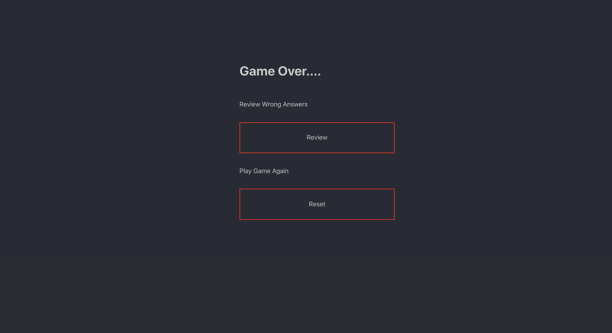
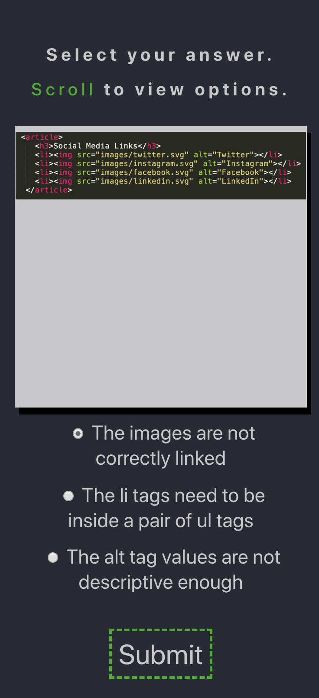

# Memoize: Mod 2

## Description

The task was to build a tool to help fellow codering students practice a coding concept. This app displays code snippets of common syntax and/or logic mistakes in the following languages/libraries: HTML, CSS, JS, JSX, SCSS, REACT. The user selects the correct answer and gains points. The next iternation of this app will save all incorrect questions so users can revisit them and pratice them later and allow users to choose their prefered practice coding language.

This project was bootstrapped with [Create React App](https://github.com/facebook/create-react-app). 

## Learning Goals
* Build a study application with React and Sass
* Demonstrate your ability to communicate expert-level knowledge on a technical topic
* Write modular, reusable code that follows SRP (Single Responsibility Principle) 

## Successes
This project was a culmination of everything I have learned so far in this module. Completing the solo project was challenging, however by investing time in whiteboarding and pseudocoding the project, I was able to move at a steady pace and navigate my way through every problem that arose. Trying out animations was also enjoyable.

## Challenges
No challenge was too overwhelming, however there are still a few issues that did not get taken care of by the deadline. (See issues below).

## Technologies Used

* HTML 
* ES6 classes
* CSS
* JavaScript
* jQuery
* React
* Manipulating APIs
* Testing with Jest & Enzyme
* Webpack
* NPM
* ESLint

## To Enjoy This Game:

Fork this repo. 

Clone the repo using 'git clone git@github.com:{your github name here}/Memoize.git'

### `npm start`

Runs the app in the development mode. 
Open [http://localhost:3000](http://localhost:3000) to view it in the browser.

The page will reload if you make edits. 
You will also see any lint errors in the console.

### `npm test`

Launches the test runner in the interactive watch mode. 
See the section about [running tests](https://facebook.github.io/create-react-app/docs/running-tests) for more information.

# Screenshots

### Home Page

### Header

### Points

### Game Over

### Mobile View

### Issues

* Local storage is not functional
* Not all functionality is tested
* Images are not all the same size (too much container movement to fit image)
* Cards cannot be saved for review after the game is complete

## Collaborators
* Katie Lewis (https://github.com/kalex19)

### License
Turing School of Software (for providing the project specifications).
